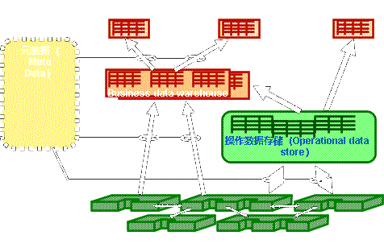

# 前言

1. 《听了课就能及格》
2. 由于老师发的复习PPT内容过多（近两万字），因此在此大幅删减
3. 由于老师透露太少，删减全凭主观意志，请谨慎参考！！！
4. 猜测逻辑
   1. 过于细碎概念的不考（不算很理论的内容）
   2. 一个大知识点的细枝末节不考（我不想背六级标题）
   3. 多次出现概念和核心概念的大概率考
   4. 尽量精炼表达，争取主观题能拿部分分，甚至可以只背概念，不背解释（不奢求考的全会）
5. 为了逻辑更清晰，有的知识点之间进行了合并、调换顺序和标题分级，因此可能小标题也会考到
6. 部分借鉴：[1-4](https://www.aiznoyer.work/2023/05/12/%E5%95%86%E5%8A%A1%E6%99%BA%E8%83%BD/)、[5](https://www.aiznoyer.work/2023/06/23/%E6%95%B0%E6%8D%AE%E4%BB%93%E5%BA%93%E4%B8%8E%E6%95%B0%E6%8D%AE%E6%8C%96%E6%8E%98%EF%BC%88%E4%B8%8B%EF%BC%89/)
7. [github](https://github.com/3210448723/BusinessIntelligenceCourse)
8. ▲：本人打算背的内容
9. 网上其它可参考内容（不一定有用）
   1. 选择判断题：[1](https://blog.csdn.net/qq_40488043/article/details/120475057)、[2](https://www.renrendoc.com/paper/273544743.html)、[3](https://www.deliwenku.com/p-5754745.html)
   2. 案例分析：[1](https://blog.csdn.net/weixin_51189637/article/details/130692757)
   3. 复习题：[1](https://easylearn.baidu.com/edu-page/tiangong/exercisedetail?id=132cd3e6142ded630b1c59eef8c75fbfc77d94a8&fr=search)

# 题型

1. 选择
2. 判断
3. 名字解释
4. 案例综述

总体而言题量较少，但记忆负担繁重，主观题尽量多写字

# 第一章 商务智能概论

## 数据、信息与知识

### 数据

* 数据是记录、描述和识别事物的**符号**，通过**有意义的组合**来表达现实世界中某种实体的特征。数据多表现为简单的**事实**。
* 数据也称为记录、案例、样本等。
* 数据用属性描述。属性也称为变量、特征、字段或维等

### 信息

* 数据经过分析后可以转换为有用的信息。
* 信息是经过某种提炼、加工和集成后的数据。 
* 信息是可以被理解和解释的，对不同的人可能价值不同。

### 数据与信息的关系

数据是信息的**载体**，信息是对数据的**解释**。

### 知识

对**信息**内容进行的提炼、比较、挖掘、分析、概括、判断和推论。

## 商务智能

### 定义▲

* 商务智能是融合了**先进信息技术**与**创新管理理念**的结合体，集成了企业内外的数据，进行加工并从中提取能够创造**商业价值**的信息
* 面向**企业战略**并服务于管理层、业务层，指导企业经营决策，提升**企业竟争力**
* 促进**信息到知识再到利润**的转变，从而实现更好的绩效。 
* 核心在于对业务的优化。

### 作用

商务智能可以使企业全面了解业务运营中的关键环节，准确获悉"**过去发生了什么事情**"，"**为什么发生这种事情**"，"**正在发生什么事情**"以及"**未来将如何发展**"等信息。

### 关心的主要问题

怎样把积累下来的数据转变为企业经营者最需要的信息和知识，从而辅助决策

### 主要特点

1. 服务企业战略
2. 提升企业绩效
3. 提炼知识辅助决策
4. 综合运用多项技术
5. 用户多样性

### 商务智能的价值▲

1. 制定合适的市场营销策略
2. 改善顾客管理
3. 经营成本与收入分析
4. 提高风险管理能力
5. 改善业务洞察力
6. 提高市场响应能力

# **第二章 商务智能系统架构**

业务系统的操作和日志数据→ETL抽取、转化、加载→ODS层→数据仓库→反哺业务

## 数据仓库分层介绍▲

### ETL层

#### 定义

是数据仓库中的**关键层**，负责将数据从各种业务系统中提取出来，并进行初步的清洗和转换。然后，把数据装载到ODS层。

> ETL：抽取（extrat）、转换（transform）、装载（load）

#### 作用

参见[ETL的功能](#功能)

### ODS层

#### [定义](#ODS定义)

操作数据存储层，是ETL层的下一个层次。

#### 作用

> 参见[ODS层作用](#ODS层作用)

将ODS层中的数据整合到一个集中的位置，并进行更深入的数据分析和汇总。

### DW层

#### [定义](#数据仓库概念▲)

是数据仓库的核心，它是数据在数据仓库中的最终目的地。

#### 作用

将ODS层中的数据整合到一个集中的位置，并进行更深入的数据分析和汇总。

#### 数据

星形模型或雪花模型

### APP层

#### 定义

是应用层，它是数据仓库的顶层。

#### 作用

将数据提供给最终用户使用。

#### 数据

APP层的数据通常是干净、一致和可用的。

### DIM层

#### 定义

是维度表的层次。

#### 作用

为DW层提供维度信息。

#### 数据

DIM层的数据通常是静态的。

## 商务智能系统主要部分

1. 数据源与数据获取
2. 数据仓库与数据集市
3. 访问工具
4. 决策支持工具
5. 商务智能应用
6. 系统管理
7. 元数据管理

## 数据集成

### 原因

企业的子公司、各部门往往各自负责**局部**的信息系统选型、建设和维护，导致大量的**信息孤岛**。

不同的用户提供的数据可能来自**不同的数据源**，数据内容、数据格式和质量千差万别，数据的准确性、真实性和完整性都不同，实施数据共享和数据分析就需要**对数据进行整理**。

### 目的

运用一定的技术手段把分布在**异构系统**中的数据按一定的规则组织成一个**整体**，使用户能有效地对其进行共享、分析。

### 构建方法

#### 数据联邦

##### 定义

* 数据联邦技术通过在现有的各种数据源上增加一个**联邦计算引擎**的方式，提供统一的数据视图，并且支持开发者通过联邦计算引擎来**统一查询和分析**异构数据源里的数据
* 开发者无需考虑数据物理位置、数据结构、操作接口和储存能力等问题，即可**在一个系统上**对同构或者异构数据库进行访问和分析。

##### 优点

数据依然保留在原来的存储位置，不必构建一个集中式数据仓库。

##### 缺点

查询反应慢，不适合频繁查询，容易出现锁争用和资源冲突问题。

#### 中间件

* 中间件通过**统一的全局数据模型**来访问异构的数据库、遗留系统和Web资源等，为异构数据源提供一种检索服务。
* 中间件位于**数据层与应用层之间**，向下协调各数据源系统，向上为访问集成数据的应用提供统一数据格式和数据访问的通用接口。

#### 主数据管理

##### 主数据（Master Data）

###### 定义

在一个组织内部跨多个系统、应用程序和业务过程中共享、使用和维护的关键业务实体的核心数据。

###### 目的

确保数据在组织内的一致性、准确性和可靠性。

##### 定义

主数据管理是通过ETL、企业信息集成（EII）等技术，从企业的多个业务系统中整合需要**共享的主数据**，集中进行数据的清洗，维护主数据的完整性、一致性和准确性的一整套规范、技术和方案，以便为业务应用系统和分析型应用提供可靠的数据源。主数据管理能够较好解决数据仓库中**数据不准确**的问题。

##### 主数据管理与数据仓库的关系

###### 联系

* 它们都是减少数据冗余和不一致性的跨部门集中式系统，都依赖ETL、元数据管理等技术保证数据质量。
* 数据仓库系统的分析结果可以输入到主数据管理系统中。

###### 区别

* 主数据管理是为业务系统提供**联机交易服务**的，而数据仓库是面向**分析型**的应用。
* 主数据管理涉及的**数据量**相对较小，在运行中主数据的**集成实时性**要求比数据仓库高。

# 第三章 数据仓库

## 数据库系统的局限性

* 数据库适于存储**高度结构化**的日常事务细节数据，而决策型数据多为**历史性、汇总性或计算性**的数据，多表现为**静态**数据，不需直接更新，但可周期性刷新。
* 决策分析型数据是**多维性**，分析内容复杂。
* 在事务处理环境中，决策者可能并不关心具体的**细节**信息。
* 分析型处理可能需要连续运行几个小时，从而**消耗大量的系统资源**。
* 决策型分析数据的**数据量大**，这些数据来自企业内部或外部。
  * 来自企业外部的数据又可能来自不同的数据库系统，在分析时直接对这些数据操作会造成**分析的混乱**。
  * 对于外部数据中的一些**非结构化数据**，传统数据库系统常常是无能为力。

## 数据仓库概念▲

数据仓库（Data Warehouse）是面向主题的、集成的、稳定的、随时间变化的数据集合，用以支持管理决策的过程。

## 数据仓库的特性▲

### 面向主题

* 数据仓库中的数据是按照各种主题来组织的。
* 面向主题的数据组织方式可在较高层次上对分析对象的数据给出完整、一致的描述，能完整、统一地刻画各个分析对象所涉及的各项数据以及数据之间的联系。

### 集成性

数据仓库中的数据是从**原有分散的源数据库**中提取出来，将这些来自不同数据源的数据**集成**起来，使之遵循统一的编码规则。

### 数据的非易失性

数据仓库中的的数据操作**主要是查询**，一般情况下并**不进行修改操作**。

### 数据的时变性

* 数据仓库的**数据时限**一般要远远**长**于业务系统的数据时限。
* 业务系统存储的是**当前数据**，而数据仓库中的数据是**历史数据**。
* 数据仓库中的数据是按照**时间顺序**追加的，它们都带有**时间属性**。

## 数据仓库的结构

数据仓库主要包括数据的提取、转换与装载（ETL）、元数据、数据集市和操作数据存储（ODS）等部分，常用的数据仓库结构如下图。

### 数据仓库系统的组成

* 源数据
* 数据仓库管理系统
* 数据仓库前端工具集
* 数据仓库

## 数据集市

### 数据仓库的问题

1. 随着部门增加，各部门都**争抢**数据仓库的资源
2. 各部门都希望**定制**数据仓库中数据

### 与数据仓库的区别

1. **数据仓库是企业级**的，能为整个企业各部门的运行提供决策支持手段。而数据集市（ Data Mart ）是**部门级别**的，一般只能为某个局部范围内的管理人员服务，也称为部门级的数据仓库。
2. 数据集市是专门为某一部门或某个特定的商业需求**定制的**，而不是根据数据容量命名的。
3. 数据集市不是数据仓库，也并非小的数据仓库，多个数据集市集合并不简单构成数据仓库。

### 分类

* 独立的数据集市
* 从属的数据集市

## 元数据

### 定义

数据仓库中的元数据是关于数据仓库中**数据的数据**，作用类似于数据库管理系统的数据字典，用于保存逻辑数据结构、文件、地址和索引等信息。

### 作用

* 数据仓库的所有数据都要通过元数据来**管理和控制**。
* 用户在使用数据仓库时，通过元数据访问数据，明确数据项的含义以及定制报表。
* 数据仓库的规模及其复杂性离不开正确的元数据管理。

### 分类

#### 技术元数据

技术元数据为开发和管理数据仓库的IT人员使用，描述与数据仓库开发、管理和维护相关的数据。

#### 业务元数据

* 业务元数据为管理层和业务分析人员服务，从业务角度描述数据。
* 使业务人员更好地理解数据仓库中哪些数据是可用的以及如何使用它们。

### 粒度

#### 定义

对数据仓库中的数据综合程度高低的一个度量，它既影响数据仓库中的数据量的多少，也影响数据仓库所能回答询问的种类。

#### 数据粒度分类

#### 影响

* 数据精度

  数据粒度越小，表示数据越细致，精度越高。

* 处理速度

  数据粒度越小，表示数据处理的速度越慢。

  > 数据粒度小意味着需要处理的数据量更大，从而会导致数据处理速度变慢。

* 可扩展性

  数据粒度越大，表示数据的可扩展性越好。

  > 数据粒度越大意味着数据处理的速度更快，从而可以处理更多的数据，提高数据的可扩展性。

## ETL▲

### 定义

是数据仓库中的**关键层**，负责将数据从各种业务系统中提取出来，并进行初步的清洗和转换。然后，把数据装载到ODS层。

### 功能

#### 数据抽取

##### 定义

确认数据源的数据及其含义。

##### 过程

1. 抽取。

   确定访问元数据库中的哪些文件或表，需要提取其中哪些字段。

2. 抽取频率。

   需要定期更新数据仓库的数据，因此对不同的数据源需要确定数据抽取的频率。

3. 输出。

   数据输出的目的地和输出的格式。

4. 异常处理。

   当需要的数据无法抽取时如何处理。

#### 数据转换

##### 不一致数据的转换

* 数据不一致包括数据源内部的不一致和多个数据源之间的数据不一致等。
* 不同业务系统的数量单位、编码、值域或语义等都需要统一。

##### 数据粒度的转换

业务系统一般存储**细粒度**的事务型数据，而数据仓库中的数据是用于查询、分析。因此需要多种不同粒度的数据。这些不同粒度的数据可以通过对细粒度的事务型数据进行**聚合**(aggregation)而产生。

#### 数据清洗

##### 定义

数据清洗(datacleaning)是数据转换的一个子集，主要是对原始数据进行清理、过滤、去重、处理异常数据等操作，以消除数据中的问题，如数据重复、二义性、不完整、违反业务或逻辑规则等，保证数据的准确性和稳定性。

##### 数据质量问题

* 缺失(missing)数据，即数据值的缺失。

* 错误数据。

  产生的主要原因是由于业务系统在数据输入后不能进行正确性判断而被录入数据库。错误数据需要被及时找出并限期修正。

* 数据重复。

  数据重复是反复录入同样的数据记录，这类数据会增加数据分析的开销。

* 数据冲突。

  数据冲突包括同一数据源内部的数据冲突和多个数据源之间的数据冲突。冲突的数据也需要及时地修正。

#### 数据加载

##### 定义

数据加载主要是将清洗、转换后的数据导入到目标数据源中，为企业业务提供数据支持。

##### 分类

###### 全量加载

将所有数据都导入目标数据源中，适用于首次加载或者数据量较小的情况。

###### 增量加载

将新增或修改的数据导入目标数据源中，以节省加载时间和系统资源，适用于数据量较大的情况。

###### 完全刷新

周期性地重写整个数据仓库，有时也可能只对一些特定的数据进行刷新。

## 操作数据存储（ODS）▲

### ODS定义

* 在DB-DW（数据库-数据仓库）之间增加的新的层次，构建DB-ODS-DW结构，满足实时或近实时的查询要求和报表需求。
* 存储全局一致的、细粒度、面向主题、集成的和时变的当前或接近当前的数据。

> 操作数据存储又称实时数据仓库。

### 操作型数据库、操作数据存储和数据仓库之间的比较

### ODS层作用

1. 实时采集和存储操作性数据。
2. 支持数据仓库ETL过程，将ODS层中的数据转换为适合DW层使用的格式。
3. 支持历史数据追溯，以便用户进行历史趋势分析。
4. 减轻源系统负担，提高系统性能。同时也可以避免对源系统进行频繁查询和分析，减少对源系统的影响。

### ODS层面临的挑战

1. 数据源多样。
2. 数据结构多样。
3. 增量变化的获取。

## 数据仓库模型▲

### 概念模型

概念模型用来表达信息世界中的**信息结构**，关系数据库一般采用实体-关系（E-R）图来作为概念模型的表示方法。

### 逻辑模型

#### 星型模型

星型模型的核心是**事实表**，事实表把各种不同的维表连接起来。

与传统的关系模型相比，星型模型简化了用户分析所需的关系，从支持决策的角度去定义数据实体，更适合大量复杂查询。

星型图包括了三种逻辑实体：指标、维度和详细类别。

> 维表的本质是多维分析空间在某个角度上的投影，多个维表共同建立一个多维分析空间。

#### 雪花模型

雪花模型是星型模型的扩展，某些维表中的数据可以进一步分解到附加的表中，以便减少冗余，节省存储空间。

雪花模型对星型模型中的维表进行进一步标准化、规范化处理。

### 物理模型

* 数据仓库的物理模型是逻辑模型在数据仓库中的实现
* 主要包含数据仓库的软硬件配置、数据的存储结构与索引、数据存储位置和存储分配等。

# 第四章 在线分析处理

## 基本概念

### OLTP

在线事务处理通常是一个或一组记录的查询和修改，用于处理短暂的**交易事务**，例如银行账目更新、实时库存变化、顾客的订单与发货情况的更新以及病人健康状况的更新等。

### OLAP

#### 定义▲

* OLAP是使管理人员能够从多种角度对从原始数据中转化出来的、能够真正为用户所理解的并真实反映业务维特性的信息进行快速、一致和交互的存取，从而获得对数据更深入的理解。
* 在多维数据上的分析称为在线分析处理（OLAP），也称为多维分析。

#### 核心

OLAP Cube。OLAP 多维数据集是一种为非常快速的数据分析而优化的数据结构。

OLAP Cube 由按维度分类的称为度量的数字事实组成。OLAP Cube 也称为超立方体。

> 接下来的这些我赌它不考主观题，列出以便于理解相关概念

### 变量

变量是数据度量的指标，是数据的实际意义。通常也把变量称为度量。

图中的数据“560”本身并没有意义，但如果描述2007年第一季度大中华区 LCD 的销售量是560 万台，则数据"560"就有了实际意义，代表了产品销售量的度量。年、季度和月份是描述时间的三个层次，10万是变量"销售额"的值。

### 维

#### 定义

维是与业务主题相关的一组属性，单个属性或属性集合可以构成一维。

例如计算机配件销售随着时间推移而产生的变化，这是从时间的角度对产品的销售进行观察。如果把一个主题的多种属性定义为多个维，那么用户就能够从多个角度组合分析销售情况。

如图所示，可以从时间维、产品维（CPU、主板、 LCD、硬盘、显卡和内存）和地区维（大中华区、北美区、拉丁美洲）分析销售量。

#### 维的层次

一个维往往可以具有多个层次，例如时间维分为年、季度、月和日等层次，地区维可以分为国家、地区、省、市等层次。这里的层次表示数据细化程度，对应概念分层。

后面提到的上钻操作就是由低层概念映射到较高层概念。概念分层除了根据概念的全序和偏序关系确定外，还可以通过对数据进行离散化或分组来实现。

#### 维的成员

维是多层次的，不同层次的取值构成一个维成员，例如，"某年某季度"、"某季度某月"等都可以是时间维的成员。

### 多维数组

多维数组用维和度量的组合表示一个多维数组，可以表示为（维1 ，维2，…，维n ，度量），例如（月份，地区，产品，销售额）组成一个多维数组。

### 数据单元（单元格）

多维数组的取值。当多维数组中每个维都有确定的取值时，就唯一确定一个变量的值。数据单元可以表示为（维1成员，维2成员，……，维n 成员，度量值），例如（2007年第一季度，大中华区，LCD，560万台）表示一个数据单元：2007 年第一季度大中华区 LCD产品销售560万台。

### 事实

事实是不同维度在某一取值下的度量 。**在各维度值(客户、产品合约、账户、机构、币种、日期)的交点处就可以得到一个度量值。**

例如上述2007年第一季度 LCD 在大中华区的销售额是560万台就表示在时间、产品和地区三个维度上企业销售事实的度量，同时包含时间维度的两个层次：年和季度。

## OLTP与OLAP的区别▲

> 懒得拍书上P58的表了

### 基本含义不同

* OLTP是**传统的关系型数据库**的主要应用，主要是基本的、日常的事务处理，记录即时的增、删、改、查，比如在银行存取一笔款，就是一个事务交易。
* OLAP即联机分析处理，是**数据仓库的核心部心**，支持复杂的分析操作，侧重决策支持，并且提供直观易懂的查询结果。典型的应用就是复杂的动态报表系统。

### 实时性要求不同

* OLTP实时性要求高，OLTP 数据库旨在使事务应用程序仅写入所需的数据，以便尽快处理单个事务。
* OLAP的实时性要求不是很高，很多应用顶多是每天更新一下数据。

### 数据量不同

* OLTP数据量不是很大，一般只读/写数十条记录，处理简单的事务。
* OLAP数据量大：OLAP支持的是动态查询，所以用户也许要通过将很多数据的统计后才能得到想要知道的信息，例如时间序列分析等等，所以处理的数据量很大。

### 用户和系统的面向性不同

* OLTP是面向**顾客**的，用于事务和查询处理。
* OLAP是面向**市场**的，用于数据分析。

### 数据库设计不同

* OLTP采用实体-联系**ER**模型和**面向应用**的数据库设计。
* OLAP采用**星型**或**雪花模型**和**面向主题**的数据库设计。

## OLAP操作

OLAP的操作是查询，也就是数据库的 SELECT 操作为主，但是查询可以很复杂

比如基于关系数据库的查询可以多表关联，可以使用COUNT、SUM、AVG 等聚合函数。

### 常用操作▲

#### 切片（slice）

选定多维数组的1维成员做数据分割的操作称为该维上的一个切片。

> 在服装消费实例分析中，对“性别、年龄、月收人”三维立方体选取年龄段进行切片，可得到26~30岁年龄段不同月收入人群中男女消费者的购买信息。

#### 切块（dice）

把多维数组中选定一个**三维子集**的操作视为切块。

> 图所示为多维数组（a）选取年龄段21~30岁进行切块，可得到此年龄段不同月收人下男女消费者的购买情况（性别， 21~30岁，月收人，购买百分比）。类似地，多维数组（b）和多维数组（c）均对应多维立方体的切块。

#### 钻取

钻取能够帮助用户获得更多的细节性数据。

##### 上钻（drill-up）

* 上钻又称上卷 roll-up，上钻操作是指通过一个维的概念分层向上攀升或者通过维归约在数据立方体上进行数据汇总。
* 上钻使用户可以站在**更高层次**观察数据

> 例如，在服装购买顾客调查中，可以按月收入分段汇总数据，把较低、中档与较高归约为"有收入"，便可以得到沿月收入维上钻的数据汇总；也可以按年龄分段汇总数据，把16岁以下与16\~20岁归约为"青少年"，21\~25岁、26\~30岁与 31\~35 岁归约为"青年"，36\~40岁与40岁以上归约为"中老年"，从而得到沿年龄段维上钻的数据汇总视图。

##### 下钻（drill-down）

* 下钻是上钻的**逆**操作。通过对某一汇总数据进行维层次的细分。
* 下钻使用户对数据能够获得更深入的了解，更容易发现问题的**本质**，从而做出正确的决策。
* 下钻可以细化到用户所关心的**详细数据**。

#### 旋转（rotate）

* 旋转又称为转轴（pivot），它通过旋转变换一个报告或页面显示的维方向，在表格中重新安排维的放置，如行列互换。
* 这种对立方体的重定位可以得到**不同视角**的信息。

</img>→</img>

# 第五章 数据挖掘

## 数据挖掘过程CRISP-DM

## 数据挖掘过程▲

### 定义业务问题

确定业务，了解需求以及问题相关背景

### 数据抽取与探测

可视化了解数据分布与统计相关信息

### 数据预处理

#### 目的

* 解决缺失值，异常数据，离散数据的独热one-hot编码和连续数据归一化处理等。
* 使数据更易于数据挖掘模型处理。

#### 数据清理

1. 删除原始数据集中的**无关**数据

2. 删除**重复**数据

3. 平滑**噪声**数据

   通过聚类（K-Means，DBSCAN，EM聚类）方法，检测孤立点。将数据集合分组为若干个簇，在簇外的值即为孤立点，这些孤立点就是噪声数据，应对这些孤立点进行删除或替换。相似或相临近的数据聚合在一起形成各个聚类集合，在这些聚类集合之外的数据即为异常数据。

4. 处理**缺失**值

   1. 删除记录

   2. 不处理

   3. 数据插补

      

5. 处理**异常**值

#### 数据集成

##### 定义

数据集成是指将来自不同来源、不同格式和不同结构的数据整合到一个**统一**的数据存储库中，以实现数据的一致性、可访问性和可用性。

##### 分类

1. 批量数据集成
2. 实时数据集成

#### 数据变换

##### 定义

数据变换将数据**格式统一**，使得挖掘过程更有效。

##### 主要方法

1. 数据规范化

   将数据按照比例进行缩放，使之落入一个特定的区域，便于进行综合分析。

2. 数据离散化

   将连续性数据切分为若干段以满足算法输入数据的需要

##### 分箱法

* 指把待处理的数据按照一定规则放进“箱子”中，采用某种方法对各个箱子中的数据进行处理。
* 以特定的条件将所有元素分类，实现数据的离散化，增强数据的稳定性。
* 本质上就是把数据进行分组。

##### 平滑

数据清理在分箱之后，要对每个箱子中的数据进行平滑处理。

* 箱均值平滑：箱中的每一个值都被箱的平均值替换。
* 箱中位数平滑：箱中的每一个值都被箱的中位数替换。
* 箱边界平滑：箱中的最大值和最小值作为箱边界，箱中的每一个值都被最近的边界值替换。

#### 数据归约

##### 定义

数据归约是指在尽可能保持数据原貌的前提下，最大限度地**精简数据量**

##### 分类

1. 数据立方体聚合
2. 数据压缩
3. 数据块消减

### 数据建模

* 监督：分类、回归
* 无监督：关联挖掘、聚类
* 混合数据挖掘（先聚类，后分类）

### 评估结果

准确率、召回率、均方误差等

### 部署

略

> 接下来这几章不算重点，且无PPT，见仁见智吧

# 第六章 移动商务智能

# 第七章 商务智能与知识管理

# 第九章 商务智能在企业绩效管理中的应用

> 考案例和应用

# 第十章 数据挖掘在电子商务中的应用

> 考案例和应用